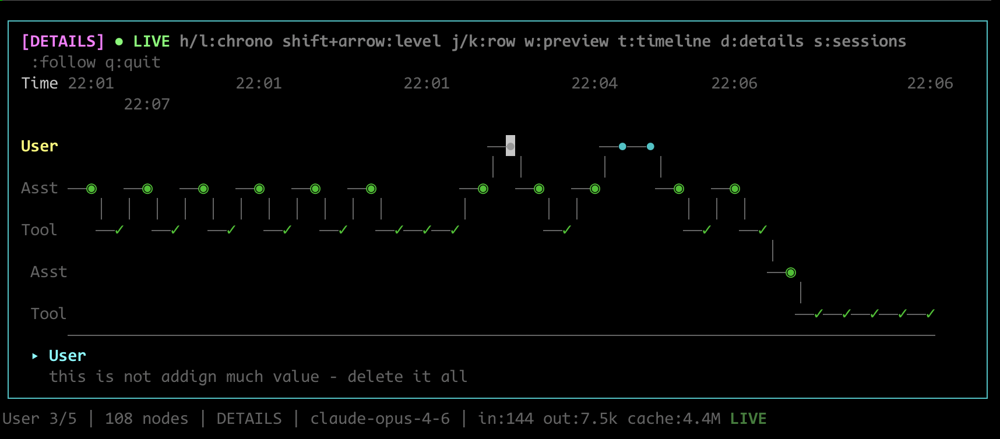

# Vizier

**Timeline visualizer for Claude Code sessions.**

Watch your sessions unfold on a horizontal timeline — zoom between high-level conversation flow and full execution detail. Built with TypeScript, Bun, and React Ink.



## Requirements

- Bun (to run the CLI)
- Claude Code sessions available under `~/.claude/projects`

## Quick Start

```bash
bun install
make dev
```

Or point at a specific project/session:

```bash
bun run src/index.tsx -- --project /path/to/project
bun run src/index.tsx -- --session <session-id> --project /path/to/project
```

## Zoom Levels

Navigate four levels of abstraction with `z` (zoom in) and `x` (zoom out):

| Level | What you see |
|---|---|
| **SESSIONS** | Bird's-eye view — first and last nodes only |
| **CONVERSATIONS** | User ↔ Assistant turns |
| **DETAILS** | Full execution tree — tools, agents, everything |
| **FOCUS** | Deep dive into a single selected node |

## Controls

### Navigation

| Key | Action |
|---|---|
| `h` / `l` | Chronological prev/next (across all levels) |
| `j` / `k` | Move down/up one branch level |
| `Shift+←` / `Shift+→` | Navigate within same level |
| `g` / `G` | Jump to start/end of current level |

### Views & Modes

| Key | Action |
|---|---|
| `z` / `x` | Zoom in / out |
| `w` | Toggle preview mode (content snippets in timeline) |
| `f` | Toggle follow mode (auto-track latest node) |
| `t` | Toggle timeline panel |
| `d` | Toggle details panel |
| `s` | Toggle session list |
| `J` / `K` | Scroll details panel |
| `q` | Quit |

## Symbols

| Symbol | Meaning |
|---|---|
| `●` | User message |
| `◉` | Assistant message |
| `⬢` | Tool call (Read, Write, Grep, etc.) |
| `✓` / `✗` | Tool success / error |
| `⟐` | Agent start/end |
| `○` | Progress |

## Features

- **Real-time updates** — watches session files as Claude Code runs
- **Session switching** — auto-discovers sessions, press `s` to browse
- **Follow mode** — `f` to auto-track the latest node in a live session
- **Preview mode** — `w` to see content snippets inline on the timeline
- **Token stats** — input/output/cache token counts in the status bar
- **Sticky context** — shows the most recent parent node before the viewport
- **Agent discovery** — automatically finds and visualizes subagent branches (see `AGENTS.md`)

## Install

```bash
make install
```

This runs `bun link` to make the `vizier` command available globally.

---

If something looks off in your timeline, double‑check the project path or session ID.
